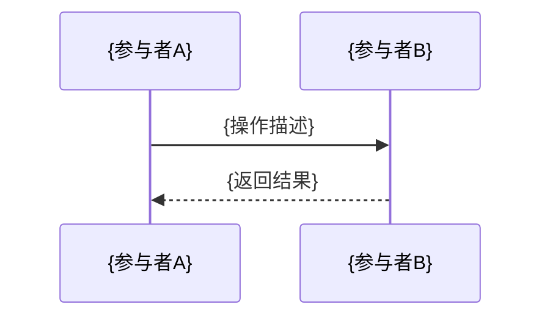
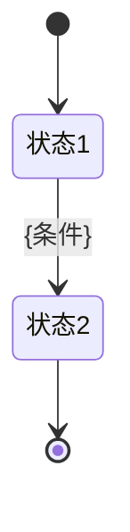

# {功能名称}技术方案

**创建时间**：{YYYY-MM-DD}
**功能模块**：{模块名称}
**文档类型**：技术方案
**文档版本**：v1.0

## 1. 技术架构概述

### 1.1 技术栈
- 以[CLAUDE.md](../../../../CLAUDE.md)中描述的为准

### 1.2 架构设计原则
- **模块化设计**：独立模块，不影响现有功能
- **数据一致性**：使用事务保证关键操作的数据一致性
- **性能优化**：合理使用索引和缓存提升查询性能

## 2. 数据库设计
- 数据库字段以及索引信息直接在生成的实体类中体现，避免后期迭代需维护多份文档
- 建表语句直接在sql文件中体现，避免后期迭代需维护多份文档

## 3. 接口设计

### 3.1 接口规范
- **统一响应格式**：使用现有R类封装响应
- **RESTful风格**：遵循REST API设计规范
- **参数校验**：使用Spring Validation进行参数校验
- **错误处理**：统一错误码和异常处理

### 3.2 核心接口设计

#### 3.2.1 {功能模块}
- 仅描述对应的类名和功能，具体实现细节直接在接口类中体现
- `{接口名称}`：{接口所在类}、{接口功能描述}

## 4. 代码结构设计

### 4.1 项目包结构
- 以[CLAUDE.md](../../../../CLAUDE.md)中描述的为准

### 4.2 核心类设计
- 仅描述对应的类名和功能，具体实现细节直接在类中体现

#### 4.2.1 实体类
- `{Entity}`：{实体所在类}、{实体说明}

#### 4.2.2 枚举类设计
- `{Enum}`：{枚举所在类}、{枚举说明}

#### 4.2.3 服务类
- `{Entity}Service`：{服务所在类}、{服务说明}

## 5. 核心业务逻辑设计

### 5.1 {业务流程名称}

#### 5.1.1 {流程}时序图


#### 5.1.2 {业务}状态图


### 5.2 {其他业务流程}

#### 5.2.1 业务规则
- **{规则1}**：{规则所在类}、{规则描述}
- **{规则2}**：{规则所在类}、{规则描述}

#### 5.2.2 {流程}用例图
```mermaid
graph TD
    A[开始] --> B{判断条件}
    B -->|条件1| C[操作1]
    B -->|条件2| D[操作2}]
    C --> E[{结束}]
    D --> E
```
