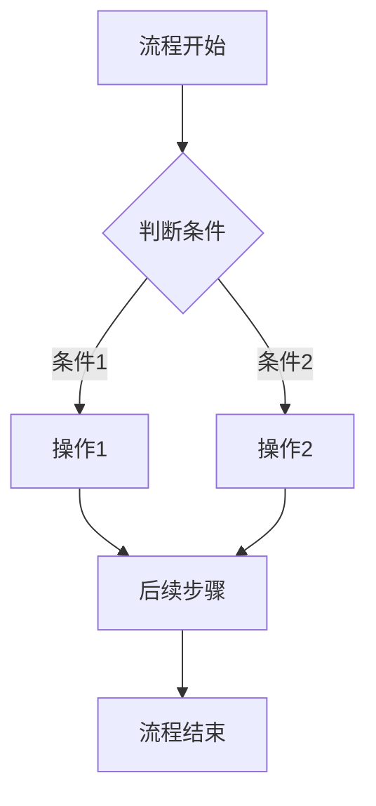
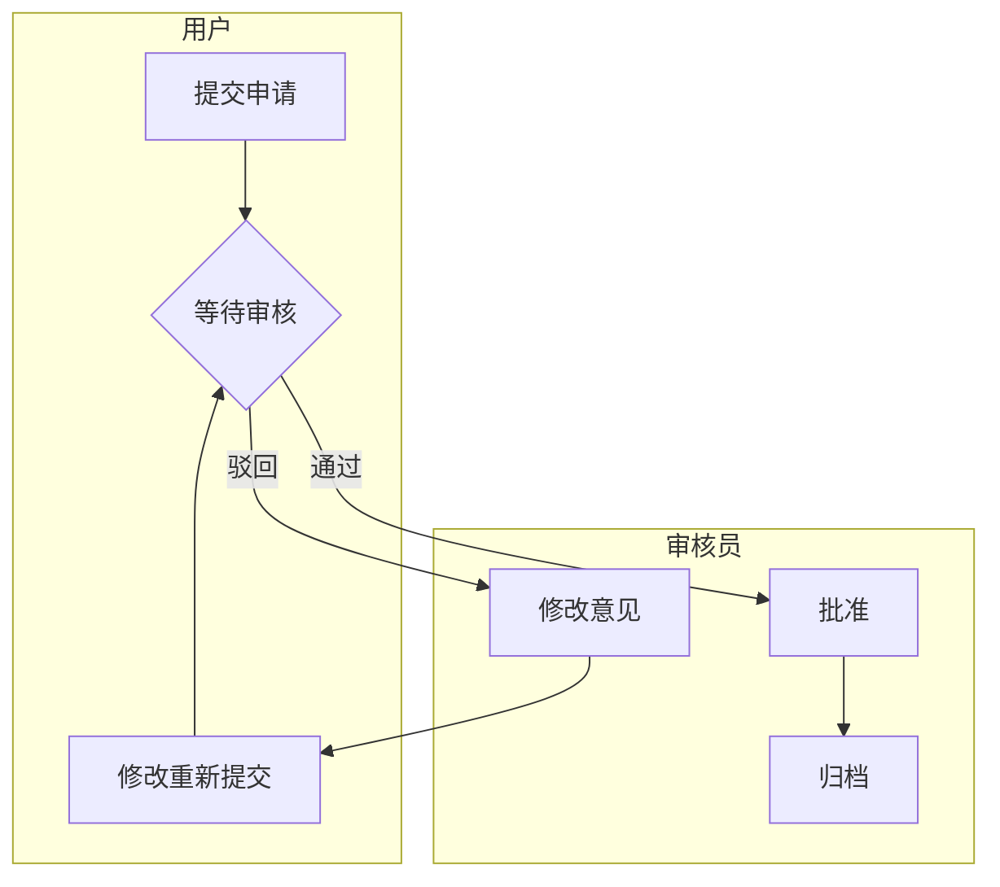

# {功能名称}需求分析

**创建时间**：{YYYY-MM-DD}
**功能模块**：{模块名称}
**文档版本**：v1.0

---

## 1. 功能概述

### 1.1 业务背景
{描述为什么需要这个功能，解决什么业务问题}

### 1.2 功能定位
{一句话描述功能的核心价值}

### 1.3 核心价值
- {价值点1}
- {价值点2}
- {价值点3}

### 1.4 需求优先级
**P0 必须实现**（核心功能）：
- {必须做的功能1}
- {必须做的功能2}

**P1 重要**（增强功能）：
- {重要的功能1}
- {重要的功能2}

**P2 可延后**（优化功能）：
- {可延后的功能1}
- {可延后的功能2}

**预期研发排期**：{预计什么时候完成，是否分阶段交付}

## 2. 用户角色与场景

### 2.1 用户角色
- **{角色1}**：{职责和权限范围}
- **{角色2}**：{职责和权限范围}

### 2.2 典型使用场景

#### 场景1：{场景名称}
{角色}在{什么情况下}需要{做什么事情}，期望{达到什么目标}。

#### 场景2：{场景名称}
{角色}在{什么情况下}需要{做什么事情}，期望{达到什么目标}。

## 3. 功能需求详述

### 3.1 {功能模块1}

#### 3.1.1 {具体功能名称}
**功能描述**：{详细描述}

**前置条件**：
- {条件1}
- {条件2}

**输入条件**：
- {输入1}
- {输入2}

**输出结果**：
- {结果1}
- {结果2}

**业务规则**：
- {规则1}
- {规则2}

#### 3.1.2 {具体功能名称}
{继续描述其他功能}

### 3.2 {功能模块2}
{继续描述其他功能模块}

## 4. 业务流程

### 4.1 {主要流程名称}

**简单流程（≤3步）**：
```
步骤1 → 步骤2 → 步骤3
```

**复杂流程（>3步或有分支）**：

**普通流程图**（适用于单一角色或不需要区分角色的流程）：


**泳道图**（适用于多角色协作的复杂业务流程）：


### 4.2 {其他重要流程}
{继续描述其他重要的业务流程}

### 4.3 异常场景处理

#### 4.3.1 提交失败
- {触发条件：什么情况下会提交失败}
- {处理方式：如何提示用户？是否允许重试？}

#### 4.3.2 审批驳回
- {触发条件：什么情况下会驳回}
- {处理方式：驳回后如何修改？能否重新提交？需要重新走流程吗？}

#### 4.3.3 超时处理
- {触发条件：多长时间无操作算超时}
- {处理方式：超时后如何处理？自动流转？还是关闭？}

#### 4.3.4 其他异常场景
- {异常场景1：{触发条件和处理方式}}
- {异常场景2：{触发条件和处理方式}}

## 5. 数据需求

### 5.1 核心数据实体

#### 5.1.1 {数据实体1}
- {从业务角度描述包含哪些信息}
- {在业务中的作用和意义}

#### 5.1.2 {数据实体2}
- {从业务角度描述包含哪些信息}
- {在业务中的作用和意义}

### 5.2 数据约束规则

#### 5.2.1 唯一性约束
- {哪些数据在业务上必须保持唯一}

#### 5.2.2 业务约束
- {数据必须满足的业务规则}

## 6. 非功能性需求

### 6.1 性能需求
- **并发量**：
  - 预期同时在线用户数：{例如：1000人}
  - 峰值并发请求量：{例如：100 QPS}
- **响应时间**：
  - 页面加载时间：{例如：< 2秒}
  - 操作响应时间：{例如：< 500ms}
  - 大数据量查询：{例如：< 3秒}
- **数据量**：
  - 预期数据规模：{例如：10万条/月}
  - 数据保留时长：{例如：1年}
- **吞吐量**：
  - 每秒处理事务数：{例如：50 TPS}

### 6.2 可用性需求
- **系统可用性**：{例如：99.9%，即每月停机时间不超过43分钟}
- **服务时间**：{例如：7×24小时服务 vs 工作时间服务}
- **容错能力**：{例如：故障时数据不丢失、操作可恢复}

### 6.3 安全需求
- **权限控制**：
  - 角色权限模型：{例如：基于角色的权限控制，不同角色有不同操作权限}
  - 数据权限：{例如：只能查看自己创建的数据，或可以查看部门数据}
  - 操作权限：{例如：管理员可删除，普通用户只能查看}
- **数据安全**：
  - 敏感数据保护：{例如：密码、手机号需要加密保护}
  - 传输安全：{例如：数据传输需要加密}
  - 数据隐私：{例如：日志中不显示敏感信息}
- **审计需求**：
  - 操作审计：{记录哪些操作？查询、新增、修改、删除}
  - 审计保留：{记录保留多长时间？例如：6个月}

### 6.4 易用性需求
- **操作便捷性**：{例如：操作步骤不超过3步、提供快捷操作}
- **界面友好性**：{例如：关键信息突出显示、错误提示清晰}
- **适配性**：{例如：需要适配哪些设备或使用场景}

## 7. 约束条件

### 7.1 业务约束
- **流程约束**：{业务流程的约束，例如：必须按顺序执行、不可跳过的步骤}
- **规则约束**：{业务规则的约束，例如：每天只能操作1次、审批必须在24小时内完成}
- **合规要求**：{法律法规、行业标准、公司规范的合规性要求}
- **数据约束**：{数据必须满足的业务约束，例如：唯一性、必填性}

### 7.2 时间约束
- **项目时间**：{项目的交付时间要求}
- **分阶段交付**：{是否需要分阶段交付，各阶段的交付时间}

## 8. 验收标准

### 8.1 功能验收标准
- {功能完整性验收标准}
- {业务流程验收标准}

### 8.2 性能验收标准
- {响应时间验收标准}
- {并发能力验收标准}

### 8.3 安全验收标准
- {权限控制验收标准}
- {数据安全验收标准}

## 9. 风险评估

### 9.1 技术风险
- {技术风险1}（{风险等级：高/中/低}）
- {技术风险2}（{风险等级：高/中/低}）

### 9.2 业务风险
- {业务风险1}（{风险等级：高/中/低}）
- {业务风险2}（{风险等级：高/中/低}）

### 9.3 风险应对
- {针对主要风险的应对措施}

---

## 确认清单

进入技术方案设计阶段前，请确认：

- [ ] 功能范围是否完整？
- [ ] 业务流程是否正确？
- [ ] 用户场景是否覆盖全面？
- [ ] 业务规则是否明确？
- [ ] 数据需求是否清晰？
- [ ] 非功能性需求是否合理？
- [ ] 约束条件是否明确？
- [ ] 验收标准是否可执行？
- [ ] 是否有遗漏的功能点或业务规则？