# 用户组织领域系统架构图

> 基于源码分析生成，覆盖用户组织领域全部工程的层级关系。

```mermaid
graph TB
    subgraph EXTERNAL["外部系统 / 客户端"]
        direction LR
        ThirdParty["第三方系统\n(ERP/HR/飞书/企微)"]
        MobileApp["移动端 App"]
        WebApp["Web 管理后台"]
    end

    subgraph GATEWAY["网关层（入口）"]
        direction LR
        api_gateway["api-gateway\nAPI统一网关\n路由/鉴权/限流"]
        openaccess["openaccess\n接入代理层\nOpenToken/AppAuth/Admin分发"]
    end

    subgraph OPEN_APP["对外开放应用层"]
        direction TB
        openorg["openorg\n组织架构服务\n部门/人员/可见性控制\n67个REST接口"]
        openadmin["openadmin\n企业管理后台\n管理员/岗位/安全策略\n68个REST接口"]
        openimport["openimport\n数据导入同步服务\n人员批量导入/第三方适配\n飞书/企微/融合流"]
        openid["openid\n开放ID服务\n第三方账号绑定/手机验证"]
        opendata_control["opendata-control\n开放数据控制\n组织数据权限/数据脱敏/授权"]
        space["space\n企业空间服务\n空间管理/成员管理\n89个REST接口"]
        innermanage["innermanage\n内部运营管理\n数据字典/审计日志/系统监控\n75个REST接口"]
    end

    subgraph SYNC_LAYER["数据同步层"]
        direction LR
        opensync["opensync\n组织同步服务\n部门/人员增量同步\n批次管理/EAS映射"]
        syncdata["syncdata\n全量数据同步\nWPS事件/Share数据同步"]
        openimport_kafka["openimport\nKafka消费端\n第三方事件异步处理"]
    end

    subgraph CORE["核心业务层（内部服务）"]
        direction TB
        usercore["usercore-service\n用户核心服务 Netty RPC\n用户/组织/角色/分组/保密规则\n86个Service类"]
        passport["passport-service\n通行证服务 Netty RPC\n统一登录/SSO/多端登录\n第三方OAuth集成"]
        baseaccount["baseaccount-service\n账号服务 Motan RPC\n账号注册/绑定/安全/迁移"]
        stakeholder["stakeholder-service\n利益相关者服务 Netty RPC\n外部人员/合作伙伴管理"]
        orgunit["orgunit-rest\n组织单元服务\n组织树/缓存/登录管理\n35个Service类"]
    end

    subgraph STATUS["状态通知层"]
        direction LR
        statusUser["statusUser-rest\n用户在线状态\n状态管理/状态同步"]
        statusNotice["statusNotice-rest\n状态变更通知\n用户状态广播/异步处理"]
    end

    subgraph SUPPORT["支撑服务层"]
        direction LR
        authserver["authserver\nOAuth2授权服务 Motan RPC\nToken签发/校验/刷新"]
        invite["invite-service\n邀请服务\n邀请码/奖励/统计"]
        snsapi["snsapi\n社交接口\n好友关系/动态发布"]
    end

    subgraph INFRA["基础设施"]
        direction LR
        MySQL[("MySQL\nt_bd_org/person\nt_bd_personorg")]
        MongoDB[("MongoDB\nYZJUserGroup\nYZJPersonRole")]
        Redis[("Redis\n分布式缓存\n会话/Token")]
        Kafka[("Kafka\n事件总线\n组织变更事件")]
        Zookeeper[("Zookeeper\n服务注册发现")]
    end

    %% 外部流量入口
    ThirdParty -->|"REST API / Webhook"| api_gateway
    MobileApp -->|"HTTP"| api_gateway
    WebApp -->|"HTTP"| api_gateway
    ThirdParty -->|"直接同步"| openimport

    %% 网关路由
    api_gateway --> openaccess
    api_gateway --> openorg
    api_gateway --> openadmin
    api_gateway --> openimport
    api_gateway --> opendata_control
    api_gateway --> space

    %% 接入代理分发
    openaccess -->|"OpenToken认证转发"| openorg
    openaccess -->|"Admin认证转发"| openadmin
    openaccess -->|"AppAuth认证转发"| opendata_control

    %% 开放层 → 核心层
    openorg -->|"Motan RPC"| usercore
    openadmin -->|"Motan RPC"| usercore
    openimport -->|"Motan RPC"| usercore
    openid -->|"Motan RPC"| usercore
    space -->|"Motan RPC"| usercore
    orgunit -->|"Motan RPC"| usercore

    %% 认证链路
    openorg -->|"Token校验"| authserver
    openadmin -->|"Token校验"| authserver
    passport -->|"Token签发"| authserver

    %% 核心层内部依赖
    usercore -->|"账号查询"| baseaccount
    passport -->|"账号验证"| baseaccount
    usercore -->|"外部人员"| stakeholder

    %% 同步层
    openimport -->|"写入"| usercore
    opensync -->|"增量同步"| usercore
    syncdata -->|"全量同步"| usercore
    Kafka -->|"消费事件"| openimport_kafka
    openimport_kafka -->|"处理"| openimport

    %% 状态层
    usercore -->|"状态变更"| statusNotice
    statusNotice -->|"广播"| statusUser

    %% 基础设施
    usercore --- MySQL
    usercore --- MongoDB
    usercore --- Redis
    usercore --- Kafka
    usercore --- Zookeeper
    baseaccount --- MySQL
    passport --- Redis

    %% 样式
    classDef gateway fill:#f4a261,stroke:#e76f51,color:#000
    classDef openApp fill:#457b9d,stroke:#1d3557,color:#fff
    classDef core fill:#2a9d8f,stroke:#264653,color:#fff
    classDef sync fill:#e9c46a,stroke:#f4a261,color:#000
    classDef status fill:#a8dadc,stroke:#457b9d,color:#000
    classDef support fill:#cdb4db,stroke:#9b72cf,color:#000
    classDef infra fill:#f1faee,stroke:#a8dadc,color:#000
    classDef external fill:#e63946,stroke:#c1121f,color:#fff

    class api_gateway,openaccess gateway
    class openorg,openadmin,openimport,openid,opendata_control,space,innermanage openApp
    class usercore,passport,baseaccount,stakeholder,orgunit core
    class opensync,syncdata,openimport_kafka sync
    class statusUser,statusNotice status
    class authserver,invite,snsapi support
    class MySQL,MongoDB,Redis,Kafka,Zookeeper infra
    class ThirdParty,MobileApp,WebApp external
```

---

## 层级说明

### 网关层（橙色）

| 工程 | 职责 |
|------|------|
| `api-gateway` | 所有外部流量统一入口，路由/鉴权/限流，基于 Netflix Zuul |
| `openaccess` | 接入代理，按认证类型（OpenToken/AppAuth/Admin）分发到下游服务 |

### 对外开放应用层（蓝色）

| 工程 | 职责 |
|------|------|
| `openorg` | 组织架构主要对外接口，第三方查询组织/人员的核心入口，67个REST接口 |
| `openadmin` | 企业管理员操作后台，岗位/角色/安全策略管理，68个REST接口 |
| `openimport` | 第三方系统同步人员数据的核心入口，集成飞书/企微适配器，支持 Kafka 异步消费 |
| `openid` | 第三方账号与云之家账号的绑定管理，手机号验证 |
| `opendata-control` | 控制第三方应用能访问哪些组织数据，数据权限授权 |
| `space` | 企业空间管理，面向用户的工作圈入口，89个REST接口 |
| `innermanage` | 内部运营管理，供平台运营人员使用，75个REST接口 |

### 数据同步层（黄色）

| 工程 | 职责 |
|------|------|
| `opensync` | ERP/HR 系统增量同步通道，维护批次号和 EAS 用户 ID 映射 |
| `syncdata` | 全量数据同步，处理 WPS 等系统的事件 |
| `openimport`（Kafka端） | 异步处理飞书/企微等平台的 Webhook 回调事件 |

### 核心业务层（绿色）

| 工程 | 职责 |
|------|------|
| `usercore-service` | 用户组织领域数据核心，Netty RPC，所有上层服务最终写入此处，86个Service类 |
| `passport-service` | 统一身份认证，登录流程核心，Netty RPC，支持第三方 OAuth 集成 |
| `baseaccount-service` | 账号（手机/邮箱）底层存储和校验，Motan RPC |
| `stakeholder-service` | 外部合作伙伴/外部人员管理，Netty RPC |
| `orgunit-rest` | 组织单元缓存层，减少对 usercore 的直接压力，35个Service类 |

### 状态通知层（浅蓝色）

| 工程 | 职责 |
|------|------|
| `statusUser-rest` | 用户在线状态管理和同步 |
| `statusNotice-rest` | 用户状态变更广播通知，异步处理 |

### 支撑服务层（紫色）

| 工程 | 职责 |
|------|------|
| `authserver` | OAuth2 Token 签发和校验，纯 Motan RPC 服务，无 Web 接口 |
| `invite-service` | 用户邀请、邀请码管理、奖励发放 |
| `snsapi` | 社交接口，好友关系、动态发布 |
